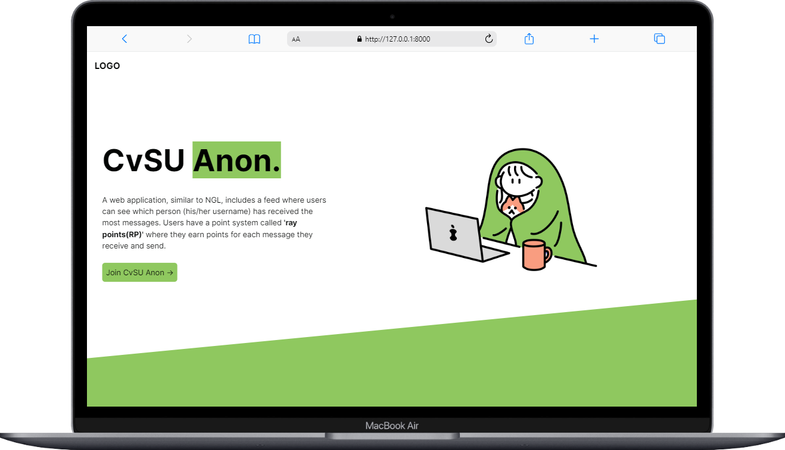

# CvSU Anon

CvSU Anon is a web application inspired by NGL. In this application, you earn points (called 'ray points') as you send and receive messages and it features a leaderboard to show who has the most RP among the users.

